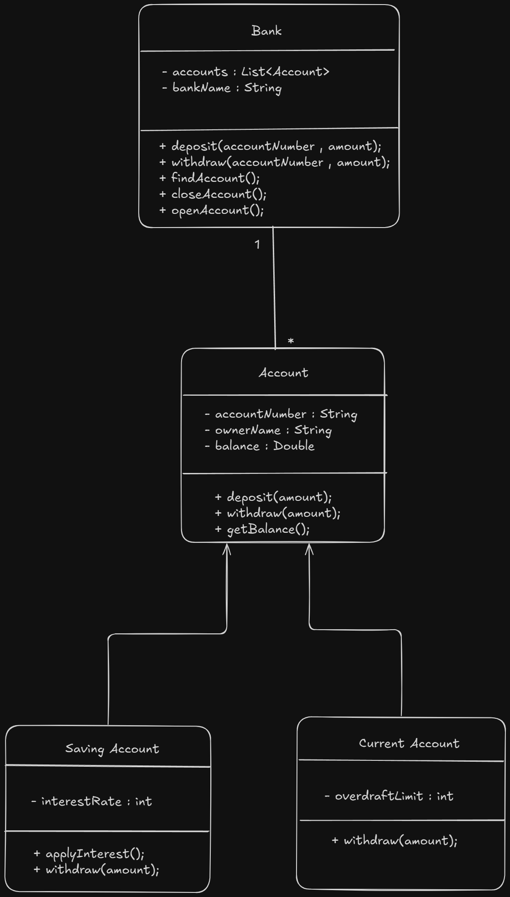

# 🏦 Basic Banking System (OOP in Java)

A simple **Object-Oriented Banking System** written in **Java** to demonstrate fundamental OOP concepts like **encapsulation, inheritance, polymorphism, and abstraction**.

---

## 📚 Features
- **Account (abstract class)** → base for all account types  
- **SavingsAccount** → supports interest, stricter withdrawal rules  
- **CurrentAccount** → supports overdraft limit  
- **Bank** → manages multiple accounts (open, close, search)  
- **Main** → entry point that demonstrates the system in action  

---

## 🧱 Project Structure
```bash
BasicBankingSystem/
├─ src/
│  └─ bank/
│     ├─ Account.java
│     ├─ SavingsAccount.java
│     ├─ CurrentAccount.java
│     ├─ Bank.java
│     └─ Main.java
├─ docs/
│  └─ uml/
│     └─ diagram-uml.png
├─ .gitignore
└─ README.md
```

---

## 🖼 UML Diagram



---

## 🛠 Requirements
- **Java 17+** (works on Java 8+, but 17 recommended)
- Any IDE (IntelliJ, Eclipse, VS Code) OR terminal

---

## ▶️ Running the Project (Terminal)

From the **project root** (the folder that contains `src/`):

```bash
# 1. Compile
javac src/bank/*.java

# 2. Run
java -cp src bank.Main
````

✅ **Note**: Always run using `bank.Main` (case-sensitive, matches `package bank;`).

---

## 📋 Sample Output

```
Initial Balances:
Alice (Savings): 1000.0
Bob (Current): 500.0

After transactions:
Alice (Savings): 1131.0
Bob (Current): 200.0
```

---

## 🧠 OOP Concepts Highlighted

* **Encapsulation** → private fields with getters/setters
* **Inheritance** → SavingsAccount & CurrentAccount extend Account
* **Polymorphism** → `withdraw()` behaves differently per account type
* **Abstraction** → `Account` is abstract; cannot be directly instantiated
* **Composition** → `Bank` has many `Account`s

---

## 🔮 Future Improvements

* Add console-based menu for user interaction
* Add `Customer` entity (one customer can have many accounts)
* Store account data in files or a database
* Add unit tests (JUnit)

---
